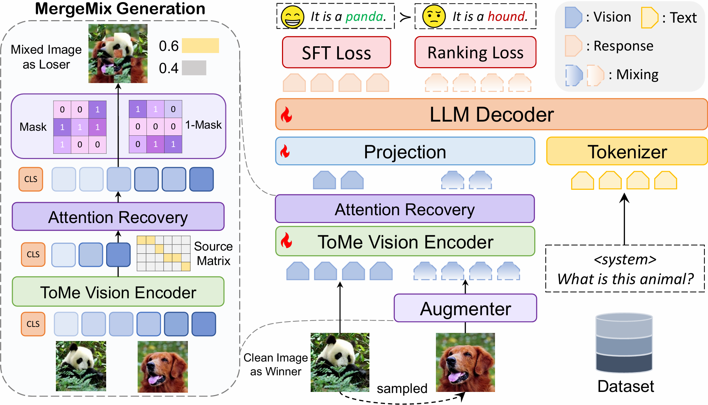
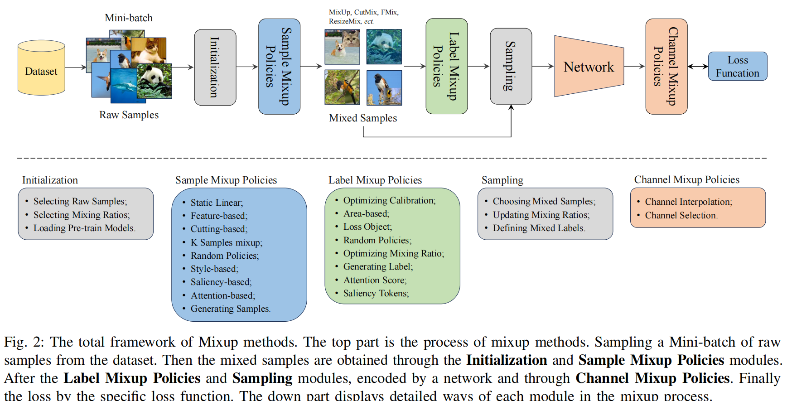
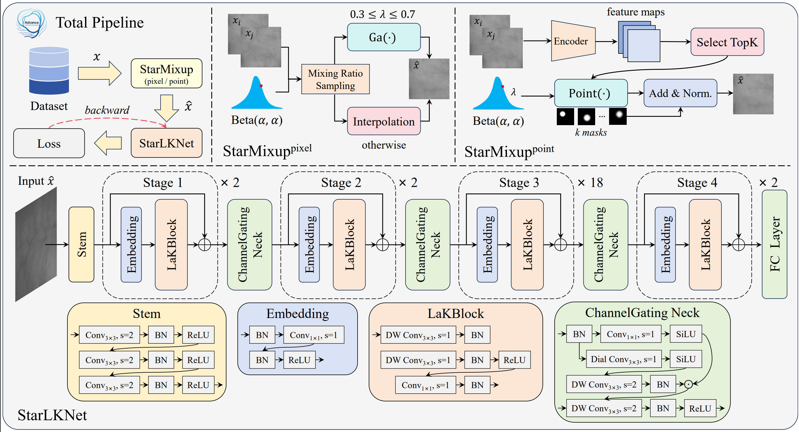
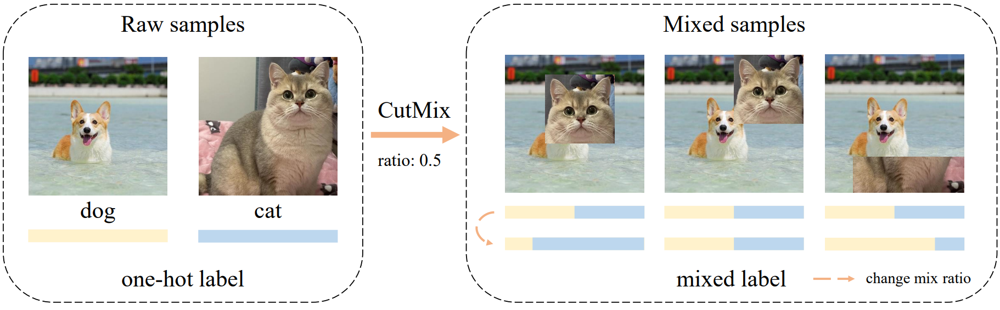
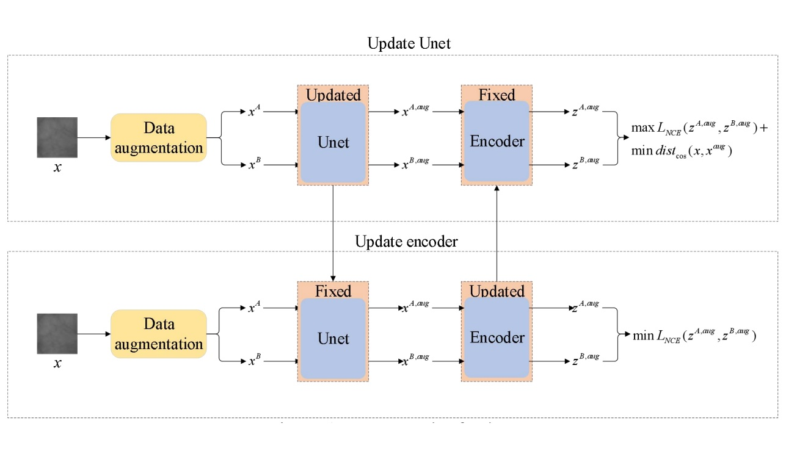
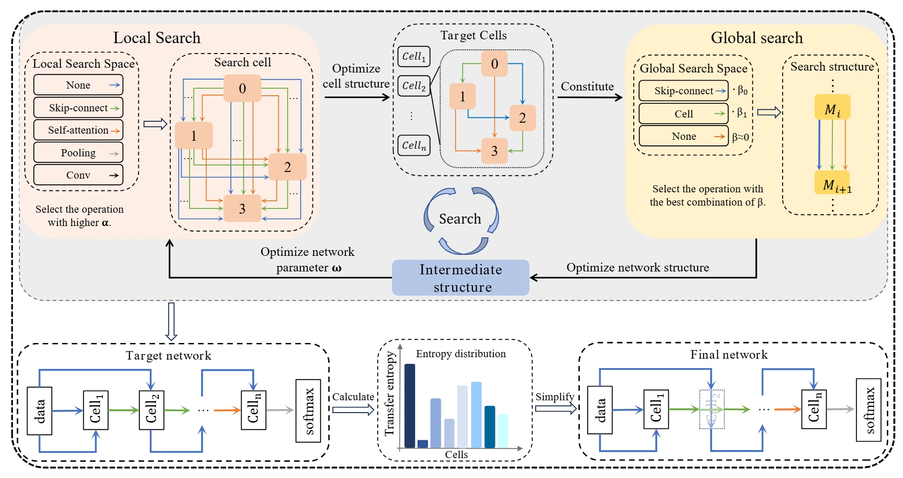
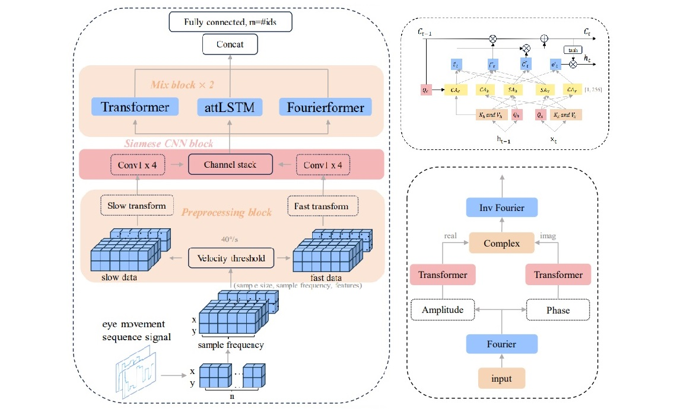
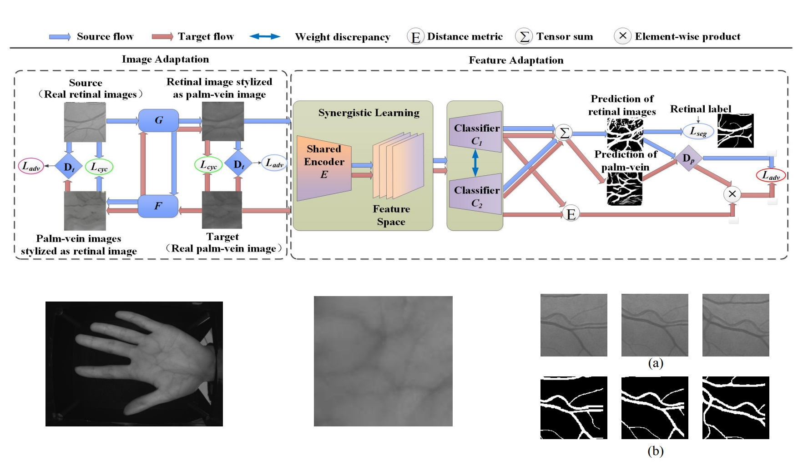

## About Me 😁
I am a research assistant at Westlake University. Supervised by Prof. [Huan Wang](https://scholar.google.com/citations?hl=zh-CN&user=0-On0y4AAAAJ) I got my M.S. degree from Chongqing Technology and Business University this year. Supervised by Prof. [Huafeng Qin](https://scholar.google.com/citations?user=5jvXcJ0AAAAJ&hl=zh-CN). I obtained B.S. degree in Internet of Things Engineering from Pass Collage of Chongqing Technology and Business University in 2022.

I am interested in **Computer Vision** and **Biometric Identification**. My current work focuses on Large Language Model(LLM) and Multi-modal Large Language Model(MLLM).  

I'm also a **photography amateur** and love to take **scenery and starry sky photos**. Of course, I don't only e-camera, I also use **film camera** to take photos.

Welcome to contacting me about research. Please drop me emails (jinxin86@westlake.edu.cn).

## News 💬 

  <ul>
    <li><b> [2025.10] </b> One paper on Mixup & MLLM, <a href="https://arxiv.org/abs/2510.23479"> MergeMix</a> is released on <b>arXiv</b>. </li>
    <li><b> [2025.02] </b> One paper on (M)LLM optimizers, <a href="https://huggingface.co/papers/2506.01049"> SGG</a> is accepted by <b>ACL 2025 main</b>, congrats to Siyuan Li, Zedong Wang and Juanxi Tian. </li>
    <li><b> [2025.02] </b> Two co-author papers on eye moment identification, <a href="https://arxiv.org/abs/2401.04956"> EMMixFormer</a> and <a href="https://arxiv.org/abs/2409.14432"> EM-DARTS</a> are accepted by <b>IEEE TIM</b>, congrats to Hongyu Zhu. </li>
    <li><b> [2024.07] </b> One paper on mixup data augmentation, <a href="https://arxiv.org/abs/2409.05202"> Survey</a>, is released on <b>arXiv</b>. </li>
    <li><b> [2024.07] </b> One paper on mixup data augmentation, <a href="https://arxiv.org/abs/2407.07805"> SUMix</a>, is accepted by <b>ECCV 2024</b>. </li>
    <li><b> [2024.05] </b> Co-author paper on vein identification, <a href="https://hsi2024.welcometohsi.org/"> GANet</a>, is accepted by <b>HSI 2024</b>, congrats to Hongchao Liao. </li>
    <li><b> [2024.01] </b> One paper on mixup data augmentation, <a href="https://arxiv.org/abs/2312.11954"> AdAutoMix</a>, is accepted by <b>ICLR 2024 (Spotlight)</b>. </li>
    <li><b> [2023.10] </b> One co-author paper on vein identification, <a href="https://ieeexplore.ieee.org/abstract/document/10417336/"> AdCL</a>, is accepted by <b>AIIIP 2023</b>, congrats to Yiquan Wu. </li>
    <li><b> [2022.12] </b> One co-author paper on vein identification, <a href="https://hal.science/hal-04304430/"> CGAN-DA</a>, is accepted by <b>Journal of Cyber-Physical-Social Intelligence 2022</b>, congrats to Shuqiang Yang. </li>
  </ul>

## Experiences 📝 {#experiences}
<!-- Chongqing Financial Institute -->
<table class="imgtable"><tr><td>
    &nbsp;</td>
    <td style="text-align:left; vertical-align:top">

        
          <b> Research Intern </b> | <a target="_blank" style="color:#2a7ce0">
            Chongqing Financial Institute
          </a>
        
         Time: July 2023 - Step 2023. Advisor: <a href="https://scholar.google.com/citations?user=5jvXcJ0AAAAJ&hl=zh-CN">  Prof. Huafeng Qin</a>. 
        
</td></tr>
</table>
          
<!-- Westlake University -->
<table class="imgtable"><tr><td>
    &nbsp;</td>
    <td style="text-align:left; vertical-align:top">

        
          <b> Research Intern </b> | <a target="_blank" style="color:#2a7ce0">
            Wsetlake University
          </a>
        
         Time: Mar. 2024 -- July 2025. Advisor: <a href="https://scholar.google.com/citations?user=Y-nyLGIAAAAJ&hl=zh-CN">  Prof. Stan Z. Li</a>. 
        
</td></tr>
</table>

<!-- Westlake University -->
<table class="imgtable"><tr><td>
    &nbsp;</td>
    <td style="text-align:left; vertical-align:top">

        
          <b> Research Assistant </b> | <a target="_blank" style="color:#2a7ce0">
            Wsetlake University
          </a>
        
         Time: July. 2025 -- Present. Advisor: <a href="https://scholar.google.com/citations?user=0-On0y4AAAAJ&hl=en">  Prof. Huan Wang</a>. 
        
</td></tr>
</table>

### Publications 📖 {#publications}
**Selected Preprints:**

<table class="imgtable"><tr><td class="table-row" style="width:220px;height:130px">
    &nbsp;</td>
    <td align="left">

        <b><a target="_blank" style="color:#2a7ce0">MergeMix: A Unified Augmentation Paradigm for Visual and Multi-Modal Understanding</a></b> 
        <b>Xin Jin</b>*, Siyuan Li*, Siyong Jian, Kai Yu, Huan Wang†
         <i><b>arXiv</b>, 2025</i> 
        [<a href="https://arxiv.org/abs/2510.23479" target="_blank" style="color:#2a7ce0">arXiv</a>]
        [<a href="https://huggingface.co/papers/2510.23479" target="_blank" style="color:#2a7ce0">HF DailyPapers</a>]
        [<a href="./assets/bibtex/ArXiv_2025_MergeMix_bibtex" target="_blank" style="color:#2a7ce0">BibTeX</a>]

</td></tr>
</table>

<table class="imgtable"><tr><td style="width:220px;height:130px">
    &nbsp;</td>
    <td align="left">

        <b><a target="_blank" style="color:#2a7ce0">A Survey on Mixup Augmentations and Beyond</a></b> 
        <b>Xin Jin</b>*, Hongyu Zhu*, Siyuan Li*, Zedong Wang, Zicheng Liu, Chang Yu, Huafeng Qin, and <i>IEEE Fellow</i> Stan. Z. Li†
         <i>arXiv, 2024</i> 
        [<a href="https://arxiv.org/abs/2409.05202" target="_blank" style="color:#2a7ce0">PDF</a>]
        [<a href="https://github.com/Westlake-AI/Awesome-Mixup" target="_blank" style="color:#2a7ce0">Awesome</a>]
        [<a href="./assets/bibtex/ArXiv_2024_MixupSurvey_bibtex" target="_blank" style="color:#2a7ce0">BibTeX</a>]

</td></tr>
</table>

<table class="imgtable"><tr><td style="width:220px;height:130px">
    &nbsp;</td>
    <td align="left">

        <b><a target="_blank" style="color:#2a7ce0">StarLKNet: Star Mixup with Large Kernel Networks for Palm Vein Identification</a></b> 
        <b>Xin Jin</b>*, Hongyu Zhu*, Mounim A. El-Yacoubi, Hongchao Liao, Huafeng Qin, and Yun Jiang†  
         <i>arXiv, 2024</i> 
        [<a href="https://arxiv.org/abs/2405.12721" target="_blank" style="color:#2a7ce0">PDF</a>]
        [<a href="./assets/bibtex/ArXiv_2024_StarLKNet_bibtex" target="_blank" style="color:#2a7ce0">BibTeX</a>]

</td></tr>
</table>

**Conferences (*: Equal Contribution. †: Corresponding Author.):**

<!-- Taming LLMs by Scaling Learning Rates with Gradient Grouping -->
<table class="imgtable"><tr><td class="table-row" style="width:220px;height:130px">
    &nbsp;</td>
    <td align="left">

        <b><a target="_blank" style="color:#2a7ce0">Taming LLMs by Scaling Learning Rates with Gradient Grouping</a></b> 
        Siyuan Li*, Juanxi Tian*, Zedong Wang*,<b>Xin Jin</b>, Zicheng Liu†, Wentao Zhang, Dan Xu
         <i><b>ACL-main</b>, 2025</i> 
        [<a href="https://arxiv.org/abs/2506.01049" target="_blank" style="color:#2a7ce0">arXiv</a>]
        [<a href="https://huggingface.co/papers/2506.01049" target="_blank" style="color:#2a7ce0">HF DailyPapers Top-4</a>]
        [<a href="./assets/bibtex/ACL_2025_SGG_bibtex" target="_blank" style="color:#2a7ce0">BibTeX</a>]

</td></tr>
</table>

<!-- SUMix: Mixup with Semantic and Uncertain Information -->
<table class="imgtable"><tr><td class="table-row" style="width:220px;height:130px">
    &nbsp;</td>
    <td align="left">

        <b><a target="_blank" style="color:#2a7ce0">SUMix: Mixup with Semantic and Uncertain Information</a></b> 
        Huafeng Qin*,†, <b>Xin Jin</b>*, Hongyu Zhu*, Hongchao Liao, Mounim A. El-Yacoubi, Xinbo Gao
         <i><b>ECCV</b>, 2024</i> 
        [<a href="https://arxiv.org/abs/2407.07805" target="_blank" style="color:#2a7ce0">PDF</a>]
        [<a href="https://github.com/JinXins/SUMix" target="_blank" style="color:#2a7ce0">Code</a>]
        [<a href="./assets/bibtex/ECCV_2024_SUMix_bibtex" target="_blank" style="color:#2a7ce0">BibTeX</a>]

</td></tr>
</table>

<!-- Adversarial AutoMixup -->
<table class="imgtable"><tr><td class="table-row" style="width:220px;height:130px">
    &nbsp;</td>
    <td align="left">

        <b><a target="_blank" style="color:#2a7ce0">Adversarial AutoMixup</a></b> 
        Huafeng Qin*,†, <b>Xin Jin</b>*, Yun Jiang, Mounim A. El-Yacoubi, Xinbo Gao
         <i><b>ICLR</b>, 2024 <b>(Spotlight)</b></i> 
        [<a href="https://arxiv.org/abs/2312.11954" target="_blank" style="color:#2a7ce0">PDF</a>]
        [<a href="https://github.com/JinXins/Adversarial-AutoMixup" target="_blank" style="color:#2a7ce0">Code</a>]
        [<a href="./assets/poster/AdAutoMix_poster_v2.pdf" target="_blank" style="color:#2a7ce0">Poster</a>]
        [<a href="./assets/bibtex/ICLR_2024_AdAutoMix_bibtex" target="_blank" style="color:#2a7ce0">BibTeX</a>]

</td></tr>
</table>

<!-- Adversarial Contrastive Learning Based on Image Generation for Palm Vein Recognition -->
<table class="imgtable"><tr><td style="width:220px;height:130px">
    &nbsp;</td>
    <td align="left">

        <b><a target="_blank" style="color:#2a7ce0">Adversarial Contrastive Learning Based on Image Generation for Palm Vein Recognition</a></b> 
        Yiquan Wu, Hongchao Liao, Hongyu Zhu, <b>Xin Jin</b>, Shuqiang Yang, Huafeng Qin
         <i>AIIIP, 2023</i> 
        [<a href="https://ieeexplore.ieee.org/abstract/document/10417336/" target="_blank" style="color:#2a7ce0">PDF</a>]
        [<a href="./assets/bibtex/AIIIP_2023_AdCL_bibtex" target="_blank" style="color:#2a7ce0">BibTeX</a>]

</td></tr>
</table>

**Journals (*: Equal Contribution. †: Corresponding Author.):**

<!-- EM-DARTS: Hierarchical Differentiable Architecture Search for Eye Movement Recognition -->
<table class="imgtable"><tr><td style="width:220px;height:130px">
    &nbsp;</td>
    <td align="left">

        <b><a target="_blank" style="color:#2a7ce0">EM-DARTS: Hierarchical Differentiable Architecture Search for Eye Movement Recognition</a></b> 
        Huafeng Qin, Hongyu Zhu, <b>Xin Jin</b>, Xin Yu, Mounim A. El-Yacoubi, and Shuqiang Yang 
         <i>TIM, 2025</i> 
        [<a href="https://ieeexplore.ieee.org/abstract/document/10919128/" target="_blank" style="color:#2a7ce0">PDF</a>]
        [<a href="./assets/bibtex/TIM_2025_EM-DARTS_bibtex" target="_blank" style="color:#2a7ce0">BibTeX</a>]

</td></tr>
</table>

<!-- EmMixformer: Mix Transformer for Eye Movement Recognition -->
<table class="imgtable"><tr><td style="width:220px;height:130px">
    &nbsp;</td>
    <td align="left">

        <b><a target="_blank" style="color:#2a7ce0">EmMixformer: Mix Transformer for Eye Movement Recognition</a></b> 
        Huafeng Qin, Hongyu Zhu, <b>Xin Jin</b>, Qun Song, Mounim A. El-Yacoubi, and <i>IEEE Fellow</i> Xinbo Gao 
         <i>TIM, 2025</i> 
        [<a href="https://arxiv.org/abs/2401.04956" target="_blank" style="color:#2a7ce0">PDF</a>]
        [<a href="https://github.com/zzx734570533/CTBU-EMglasses-database" target="_blank" style="color:#2a7ce0">Database</a>]
        [<a href="./assets/bibtex/TIM_2025_EMMixFomer_bibtex" target="_blank" style="color:#2a7ce0">BibTeX</a>]

</td></tr>
</table>

<!-- CGAN-DA: A Cross-Modality Domain Adaptation Model for Hand-Vein Biometric-based Authentication -->
<table class="imgtable"><tr><td style="width:220px;height:130px">
    &nbsp;</td>
    <td align="left">

        <b><a target="_blank" style="color:#2a7ce0">CGAN-DA: A Cross-Modality Domain Adaptation Model for Hand-Vein Biometric-based Authentication</a></b> 
        Shuqiang Yang, Yiquan Wu, <b>Xin Jin</b>, Mounim A. El-Yacoubi, Huafeng Qin
         <i>Journal of Cyber-Physical-Social Intelligence, 2022</i> 
        [<a href="https://hal.science/hal-04304430/" target="_blank" style="color:#2a7ce0">PDF</a>]
        [<a href="./assets/bibtex/JCPSI_2022_CGAN-DA_bibtex" target="_blank" style="color:#2a7ce0">BibTeX</a>]

</td></tr>
</table>

### Services 🧸
 - **Conference Reviewer:**  
2024 - International Conference on Learning Representations (ICLR), 2025  
 - **Journal Reviewer:**  
Not yet.
 - **Membership**  
2024 - Student Member of IEEE  
2024 - Student Member of China Computer Federation (CCF)

### Awards 🏆 
 - Academic Progress Award, CTBU, 2023
 - Challenge Cup of "Qin Chuang Yuan", National 2nd prize, 2024
 - The 14th Challenge Cup, Provincial 2nd prize, 2024
 - China International Student Innovation Competition, Provincial 2nd prize, 2024
 - The 7th Art Exhibition for College Students in Chongqing, Provincial 1st prize, 2023

### Interests 📝 
Photography.   
You could see some photos on <a href="https://500px.com.cn/XinJin">500px website</a> (Long time without update...)