### About Me 😁
I am a research assistant at Westlake University, supervised by Prof. [Huan Wang](https://scholar.google.com/citations?hl=zh-CN&user=0-On0y4AAAAJ). I received my M.S. degree in Computer Science from Chongqing Technology and Business University in 2025, under the supervision of Prof. Huafeng Qin. In 2022, I obtained my B.E. degree in Internet of Things Engineering from Pass Collage of Chongqing Technology and Business University.

**Research:** Currently, my research centers on **Efficient AI**, **Large Language Models**, and **Multi-modal Large Language Models**. Previously, my research focused on Data Augmentation and Biometric Identification.

**Interests:** In my spare time, I am an amateur photographer with a passion for capturing scenery and starry sky shots 🌌. I use both digital cameras 📷 and film cameras 🎞️ for my photography.

Feel free to contact me for academic and research discussions. Please drop me an email at ``jinxin86@westlake.edu.cn``.

**I am actively seeking 26 Fall or 27 Spring PhD opportunities!**

### News 💬 

  <ul>
    <li><b> [March, 2026] </b> 📕 [Preprint] One first-author paper on palm vein identification <a href="./assets/StarLKNet.pdf"> StarLKNet</a>, is released. </li>
    <li><b> [March, 2026] </b> 📕 [Preprint] Our co-author paper on omini understanding benchmark <a href="https://arxiv.org/abs/2603.19217"> LVOmniBench</a>, is released on <b>arXiv</b>. </li>
    <li><b> [Feb, 2026] </b> 🎉 [CVPR2026] One co-first author paper on efficient video understanding, EarlyTom is accpted by <b>CVPR 2026</b>, congrats to Hesong Wang. </li>
    <li><b> [Jan, 2026] </b> 🎉 One paper on efficient mixup augmentation and preference tuning, <a href="https://arxiv.org/abs/2510.23479"> MergeMix</a> is accpted by <b>ICLR 2026</b>. </li>
    <li><b> [Oct, 2025] </b> 📕 [ICLR2026] One paper on Mixup & MLLM, <a href="https://arxiv.org/abs/2510.23479"> MergeMix</a> is released on <b>arXiv</b>. </li>
    <li><b> [Feb, 2025] </b> 🎉 [ACL2025] One co-author paper on (M)LLM optimizers, <a href="https://huggingface.co/papers/2506.01049"> SGG</a> is accepted by <b>ACL 2025 main</b>, congrats to Siyuan Li, Juanxi Tian and Zedong Wang. </li>
    <li><b> [Feb, 025] </b> 🎉 [IEEE TIM] Two co-author papers on eye moment identification, <a href="https://arxiv.org/abs/2401.04956"> EMMixFormer</a> and <a href="https://arxiv.org/abs/2409.14432"> EM-DARTS</a> are accepted by <b>IEEE TIM</b>, congrats to Hongyu Zhu. </li>
    <li><b> [Nov, 2024] </b> 🎉 [CCBR2024] One co-first author paper on eye moment identification, <a href="https://link.springer.com/chapter/10.1007/978-981-96-1071-6_11"> Relax DARTS</a>, is accepted by <b>CCBR 2024 (Oral)</b>, congrats to Hongyu Zhu. </li>
    <li><b> [Jul, 2024] </b> 📕 [Preprint] One survey on mixup data augmentation, <a href="https://arxiv.org/abs/2409.05202"> Survey</a>, is released on <b>arXiv</b>. </li>
    <li><b> [Jul, 2024] </b> 🎉 [ECCV2024] One paper on mixup data augmentation, <a href="https://arxiv.org/abs/2407.07805"> SUMix</a>, is accepted by <b>ECCV 2024</b>. </li>
    <li><b> [May, 2024] </b> 🎉 [HSI2024] One co-first author paper on vein identification, <a href="https://hsi2024.welcometohsi.org/"> GANet</a>, is accepted by <b>HSI 2024 (Oral)</b>, congrats to Hongchao Liao. </li>
    <li><b> [Jan, 2024] </b> 🎉 [ICLR2024] One paper on mixup data augmentation, <a href="https://arxiv.org/abs/2312.11954"> AdAutoMix</a>, is accepted by <b>ICLR 2024 (Spotlight)</b>. </li>
  </ul>

### Experiences 📝
<!-- Chongqing Financial Institute -->
<table class="imgtable"><tr><td>
    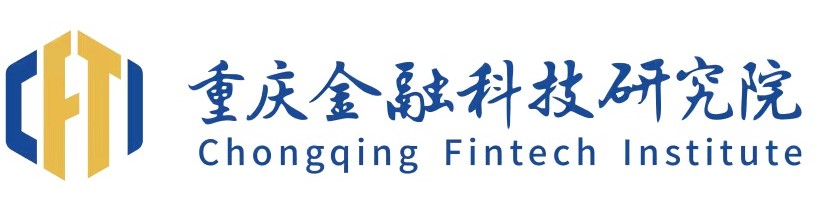&nbsp;</td>
    <td style="text-align:left; vertical-align:top">

        
          <b> Research Intern </b> | <a target="_blank" style="color:#2a7ce0">
            Chongqing Financial Institute
          </a>
        
         Time: July 2023 - Sept 2023. Advisor: <a href="https://scholar.google.com/citations?user=5jvXcJ0AAAAJ&hl=zh-CN">  Prof. Huafeng Qin</a>. 
        
</td></tr>
</table>
          
<!-- Westlake University -->
<table class="imgtable"><tr><td>
    &nbsp;</td>
    <td style="text-align:left; vertical-align:top">

        
          <b> Research Intern </b> | <a target="_blank" style="color:#2a7ce0">
            Westlake University
          </a>
        
         Time: Mar. 2024 -- July 2025. Advisor: <a href="https://scholar.google.com/citations?user=Y-nyLGIAAAAJ&hl=zh-CN">  Prof. Stan Z. Li</a>. 
        
</td></tr>
</table>

<!-- Westlake University -->
<table class="imgtable"><tr><td>
    &nbsp;</td>
    <td style="text-align:left; vertical-align:top">

        
          <b> Research Assistant </b> | <a target="_blank" style="color:#2a7ce0">
            Westlake University
          </a>
        
         Time: July. 2025 -- Present. Advisor: <a href="https://scholar.google.com/citations?user=0-On0y4AAAAJ&hl=en">  Prof. Huan Wang</a>. 
        
</td></tr>
</table>

### Publications 📖
**Selected Preprints:**

<table class="imgtable"><tr><td style="width:220px;height:130px">
    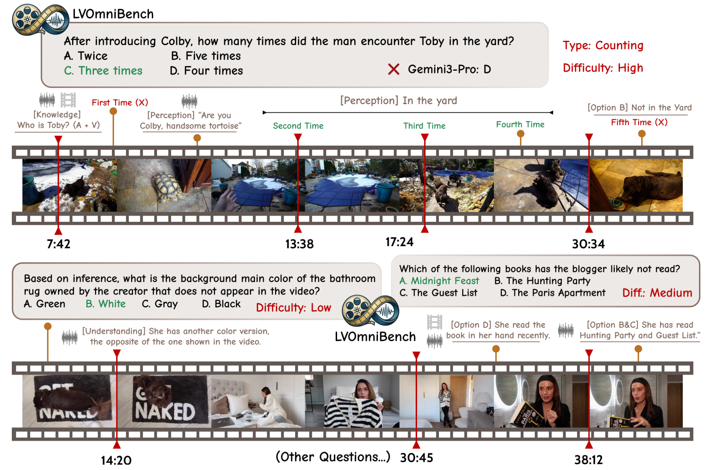&nbsp;</td>
    <td align="left">

        <b><a target="_blank" style="color:#2a7ce0">LVOmniBench: Pioneering Long Audio-Video Understanding Evaluation for Omnimodal LLMs</a></b> 
        <b>Keda Tao</b>🌟, Yuhua Zhen🌟, Jia Xu, Wenjie Du, Kele Shao, Hesong Wang, Xueyi Chen, Xin Jin, Junhan Zhu, Bohan Yu, Weiqiang Wang, Jian Liu, Can Qin, Yulun Zhang, Ming-Hsuan Yang, and Huan Wang✉️  
         <i>arXiv, 2026</i> 
        [<a href="https://arxiv.org/abs/2603.19217" target="_blank" style="color:#2a7ce0">arXiv</a>]
        [<a href="https://huggingface.co/papers/2603.19217" target="_blank" style="color:#2a7ce0">PDF</a>]
        [<a href="https://huggingface.co/datasets/KD-TAO/LVOmniBench" target="_blank" style="color:#2a7ce0">Dataset</a>]
        [<a href="https://kd-tao.github.io/LVOmniBench/" target="_blank" style="color:#2a7ce0">Webpage</a>]

</td></tr>
</table>

<table class="imgtable"><tr><td style="width:220px;height:130px">
    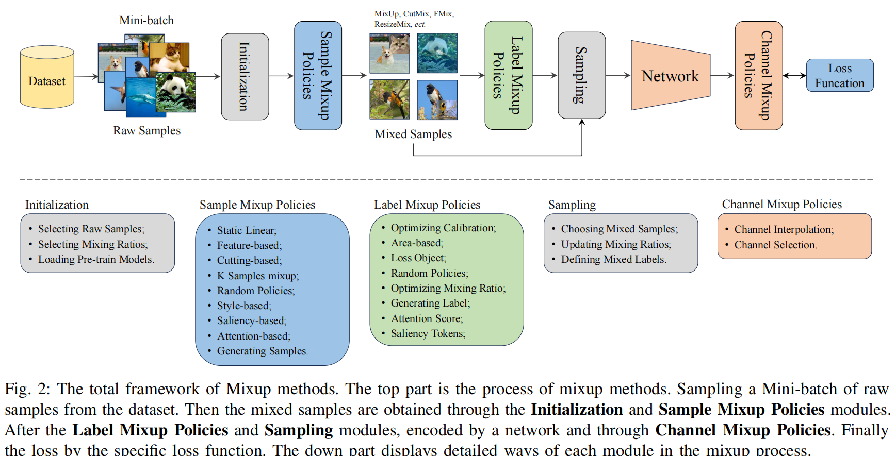&nbsp;</td>
    <td align="left">

        <b><a target="_blank" style="color:#2a7ce0">A Survey on Mixup Augmentations and Beyond</a></b> 
        <b>Xin Jin</b>🌟, Hongyu Zhu🌟, Siyuan Li🌟, Zedong Wang, Zicheng Liu, Juanxi Tian, Chang Yu, Huafeng Qin, and <i>IEEE Fellow</i> Stan. Z. Li✉️
         <i>arXiv, 2024</i> 
        [<a href="https://arxiv.org/abs/2409.05202" target="_blank" style="color:#2a7ce0">arXiv</a>]
        [<a href="https://github.com/Westlake-AI/Awesome-Mixup" target="_blank" style="color:#2a7ce0">Awesome</a>]
        [<a href="./assets/bibtex/ArXiv_2024_MixupSurvey_bibtex" target="_blank" style="color:#2a7ce0">BibTeX</a>]

</td></tr>
</table>

<table class="imgtable"><tr><td style="width:220px;height:130px">
    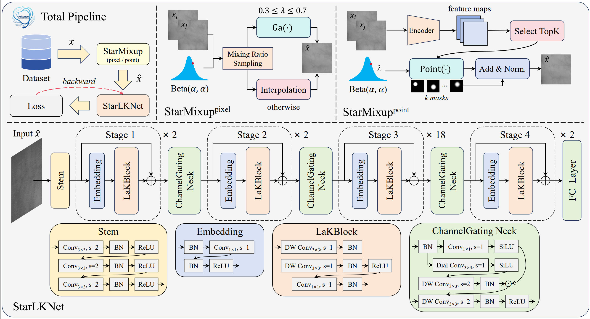&nbsp;</td>
    <td align="left">

        <b><a target="_blank" style="color:#2a7ce0">Unleashing Palm Vein Recognition via Smooth Mask Mixup and Large Kernel-based Network</a></b> 
        <b>Xin Jin</b>🌟, Hongyu Zhu🌟, Mounim A. El-Yacoubi, Haiyang Li, Xingrong Fan, Lin Chen, Yun Jiang✉️, and Qun Song✉️  
         <i>arXiv, 2024</i> 
        [<a href="./assets/StarLKNet.pdf" target="_blank" style="color:#2a7ce0">PDF</a>]

</td></tr>
</table>

**Conferences (🌟: Equal Contribution. ✉️: Corresponding Author.):**

<!-- EarlyTom: Early Token Compression Completes Fast Video Understanding -->
<table class="imgtable"><tr><td class="table-row" style="width:220px;height:130px">
    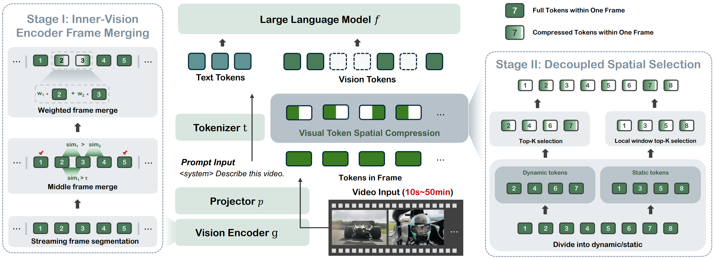&nbsp;</td>
    <td align="left">

        <b><a target="_blank" style="color:#2a7ce0">EarlyTom: Early Token Compression Completes Fast Video Understanding</a></b> 
        Hesong Wang🌟, <b>Xin Jin</b>🌟, Lu Lu, Chenhaowen Li, Jian Chenm Qiang Liu, Huan Wang✉️
         <i><b>CVPR</b>, 2026</i> 
        

</td></tr>
</table>

<!-- MergeMix: A Unified Augmentation Paradigm for Visual and Multi-Modal Understanding -->
<table class="imgtable"><tr><td class="table-row" style="width:220px;height:130px">
    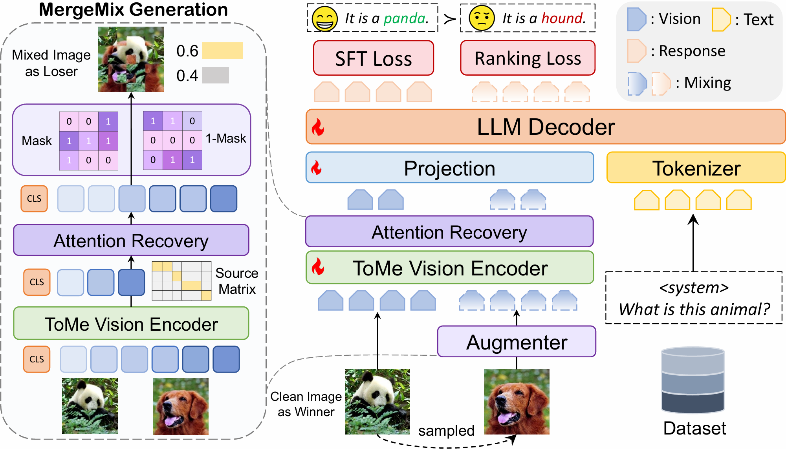&nbsp;</td>
    <td align="left">

        <b><a target="_blank" style="color:#2a7ce0">MergeMix: A Unified Augmentation Paradigm for Visual and Multi-Modal Understanding</a></b> 
        <b>Xin Jin</b>🌟, Siyuan Li🌟, Siyong Jian, Kai Yu, Huan Wang✉️
         <i><b>ICLR</b>, 2026</i> 
        [<a href="https://jinxins.github.io/MergeMix_Web/" target="_blank" style="color:#2a7ce0">Website</a>]
        [<a href="https://arxiv.org/abs/2510.23479" target="_blank" style="color:#2a7ce0">arXiv</a>]
        [<a href="https://huggingface.co/papers/2510.23479" target="_blank" style="color:#2a7ce0">HF DailyPapers</a>]
        [<a href="./assets/bibtex/ArXiv_2025_MergeMix_bibtex" target="_blank" style="color:#2a7ce0">BibTeX</a>]

</td></tr>
</table>

<!-- Taming LLMs by Scaling Learning Rates with Gradient Grouping -->
<table class="imgtable"><tr><td class="table-row" style="width:220px;height:130px">
    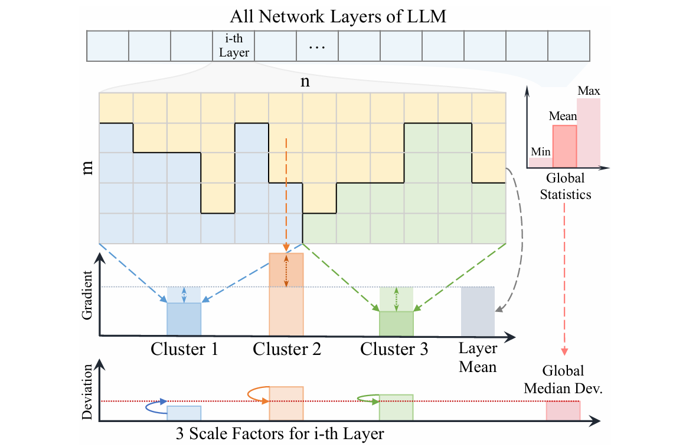&nbsp;</td>
    <td align="left">

        <b><a target="_blank" style="color:#2a7ce0">Taming LLMs by Scaling Learning Rates with Gradient Grouping</a></b> 
        Siyuan Li🌟, Juanxi Tian🌟, Zedong Wang🌟,<b>Xin Jin</b>, Zicheng Liu✉️, Wentao Zhang, Dan Xu
         <i><b>ACL-main</b>, 2025</i> 
        [<a href="https://arxiv.org/abs/2506.01049" target="_blank" style="color:#2a7ce0">arXiv</a>]
        [<a href="https://huggingface.co/papers/2506.01049" target="_blank" style="color:#2a7ce0">HF DailyPapers Top-4</a>]
        [<a href="./assets/bibtex/ACL_2025_SGG_bibtex" target="_blank" style="color:#2a7ce0">BibTeX</a>]

</td></tr>
</table>

<!-- SUMix: Mixup with Semantic and Uncertain Information -->
<table class="imgtable"><tr><td class="table-row" style="width:220px;height:130px">
    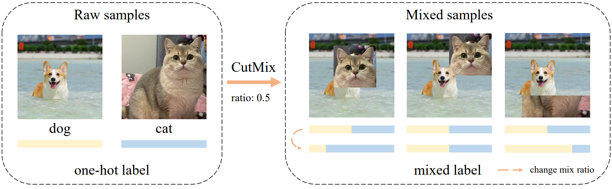&nbsp;</td>
    <td align="left">

        <b><a target="_blank" style="color:#2a7ce0">SUMix: Mixup with Semantic and Uncertain Information</a></b> 
        Huafeng Qin🌟,✉️, <b>Xin Jin</b>🌟, Hongyu Zhu🌟, Hongchao Liao, Mounim A. El-Yacoubi, Xinbo Gao
         <i><b>ECCV</b>, 2024</i> 
        [<a href="https://arxiv.org/abs/2407.07805" target="_blank" style="color:#2a7ce0">arXiv</a>]
        [<a href="https://github.com/JinXins/SUMix" target="_blank" style="color:#2a7ce0">Code</a>]
        [<a href="./assets/poster/SUMix_poster.pdf" target="_blank" style="color:#2a7ce0">Poster</a>]
        [<a href="./assets/bibtex/ECCV_2024_SUMix_bibtex" target="_blank" style="color:#2a7ce0">BibTeX</a>]

</td></tr>
</table>

<!-- Adversarial AutoMixup -->
<table class="imgtable"><tr><td class="table-row" style="width:220px;height:130px">
    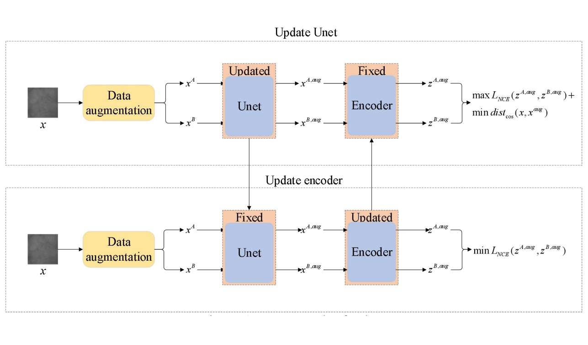&nbsp;</td>
    <td align="left">

        <b><a target="_blank" style="color:#2a7ce0">Adversarial AutoMixup</a></b> 
        Huafeng Qin🌟,✉️, <b>Xin Jin</b>🌟, Yun Jiang, Mounim A. El-Yacoubi, Xinbo Gao
         <i><b>ICLR</b>, 2024 <b>(Spotlight)</b></i> 
        [<a href="https://arxiv.org/abs/2312.11954" target="_blank" style="color:#2a7ce0">arXiv</a>]
        [<a href="https://github.com/JinXins/Adversarial-AutoMixup" target="_blank" style="color:#2a7ce0">Code</a>]
        [<a href="./assets/poster/AdAutoMix_poster_v2.pdf" target="_blank" style="color:#2a7ce0">Poster</a>]
        [<a href="./assets/bibtex/ICLR_2024_AdAutoMix_bibtex" target="_blank" style="color:#2a7ce0">BibTeX</a>]

</td></tr>
</table>

**Journals:**

<!-- EM-DARTS: Hierarchical Differentiable Architecture Search for Eye Movement Recognition -->
<table class="imgtable"><tr><td style="width:220px;height:130px">
    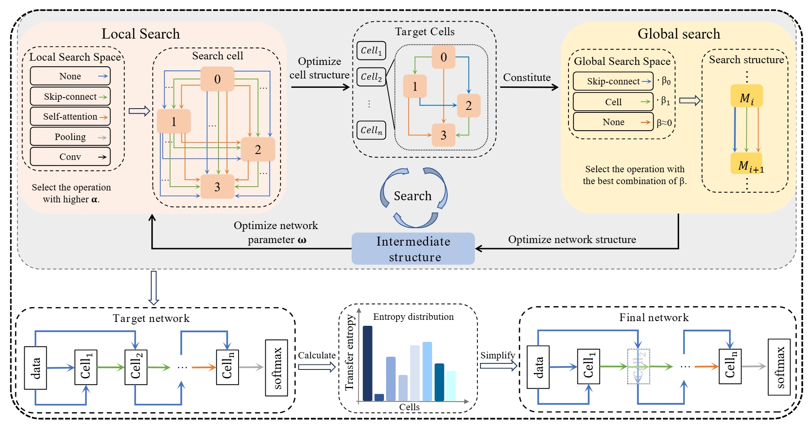&nbsp;</td>
    <td align="left">

        <b><a target="_blank" style="color:#2a7ce0">EM-DARTS: Hierarchical Differentiable Architecture Search for Eye Movement Recognition</a></b> 
        Huafeng Qin, Hongyu Zhu, <b>Xin Jin</b>, Xin Yu, Mounim A. El-Yacoubi, and Shuqiang Yang 
         <i><b>IEEE TIM, 2025</b></i> 
        [<a href="https://ieeexplore.ieee.org/abstract/document/10919128/" target="_blank" style="color:#2a7ce0">IEEE</a>]
        [<a href="./assets/bibtex/TIM_2025_EM-DARTS_bibtex" target="_blank" style="color:#2a7ce0">BibTeX</a>]

</td></tr>
</table>

<!-- EmMixformer: Mix Transformer for Eye Movement Recognition -->
<table class="imgtable"><tr><td style="width:220px;height:130px">
    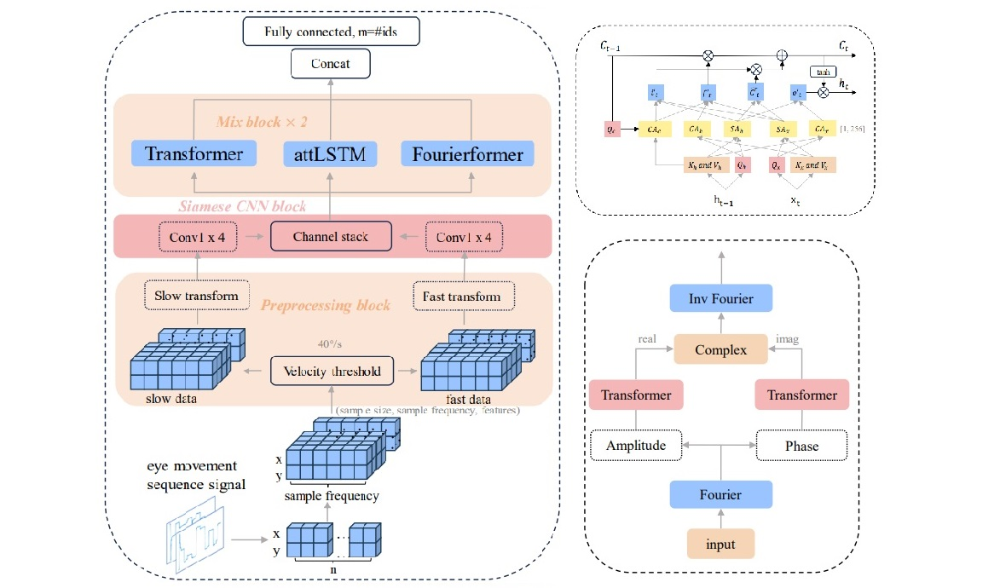&nbsp;</td>
    <td align="left">

        <b><a target="_blank" style="color:#2a7ce0">EmMixformer: Mix Transformer for Eye Movement Recognition</a></b> 
        Huafeng Qin, Hongyu Zhu, <b>Xin Jin</b>, Qun Song, Mounim A. El-Yacoubi, and <i>IEEE Fellow</i> Xinbo Gao 
         <i><b>IEEE TIM, 2025</b></i> 
        [<a href="https://arxiv.org/abs/2401.04956" target="_blank" style="color:#2a7ce0">IEEE</a>]
        [<a href="https://github.com/zzx734570533/CTBU-EMglasses-database" target="_blank" style="color:#2a7ce0">Database</a>]
        [<a href="./assets/bibtex/TIM_2025_EMMixFomer_bibtex" target="_blank" style="color:#2a7ce0">BibTeX</a>]

</td></tr>
</table>

### Services 🧸
 - **Conference Reviewer:**  
ICLR (2025-2026), CVPR (2026), ICML (2026), ECCV (2026), ~~NeurIPS (2026)~~
 - **Journal Reviewer:**  
Pattern Recognition.
 - **Membership**  
2024 - 2025 Student Member of IEEE  
2024 - 2025 Member of China Computer Federation (CCF)

### Awards 🏆 
 - Challenge Cup of "Qin Chuang Yuan", National 2nd prize, 2024
 - The 14th Challenge Cup, Provincial 2nd prize, 2024
 - China International Student Innovation Competition, Provincial 2nd prize, 2024
 - The 7th Art Exhibition for College Students in Chongqing, Provincial 1st prize, 2023
 - Academic Progress Award, CTBU, 2023-2025

### Interests 📝 
Photography. You could see some photos on <a href="https://500px.com.cn/XinJin">500px website</a> (Long time without update...)

  

