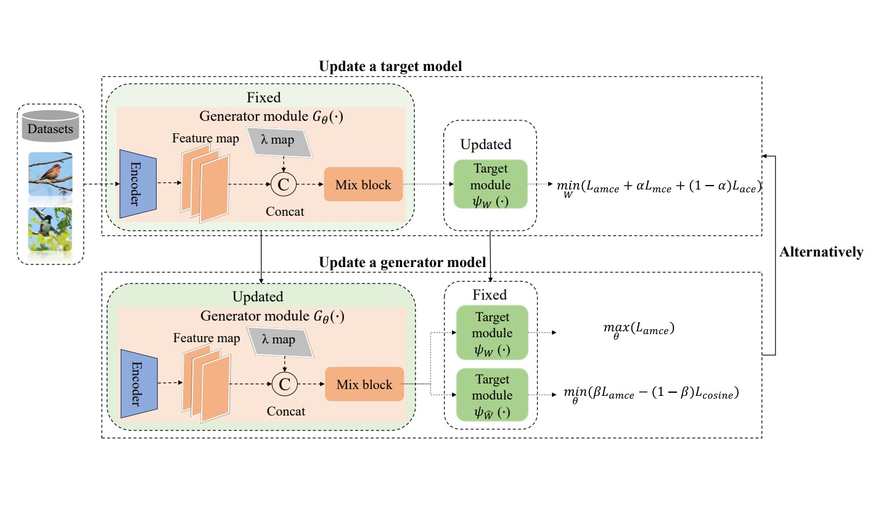

# About Me 😁
I am currently a second-year Master's Degree Candidate at Chongqing Technology and Business University. Supervised by Prof. [Huafeng Qin](https://scholar.google.com/citations?user=5jvXcJ0AAAAJ&hl=zh-CN). I obtained B.S. degree in Internet of Things Engineering from Pass Collage of Chongqing Technology and Business University in 2022.

I am interested in Computer Vision and Biometric Identification. My current work focuses on Mixup Data Augmentation and Vein Identification.

<i><b>Welcome to contacting me about research. Please drop me emails (jinxin20001118@163.com) or WeChat me (xinxinxinxin_j).</b></i>

# News 💬 
<!-- 
 -->
  

  <ul>
    <li><b> [2024.01] </b> One paper on <i>mixup data augmentation</i>, <i><a href="https://arxiv.org/abs/2312.11954"> AdAutoMix</a></i>, is accepted by <b>ICLR 2024 (Spotlight)</b>. </li>
    <li><b> [2023.10] </b> Co-author paper on <i>vein identification</i>, <i><a href="https://ieeexplore.ieee.org/abstract/document/10417336/"> AdCL</a></i>, is accepted by <b>AIIIP 2023</b>, congrats to Yiquan Wu. </li>
    <li><b> [2022.12] </b> Co-author paper on <i>vein identification</i>, <i><a href="https://hal.science/hal-04304430/"> CGAN-DA</a></i>, is accepted by <b>Journal of Cyber-Physical-Social Intelligence 2022</b>, congrats to Shuqiang Yang. </li>
  </ul>

# Experiences 📝 
<!-- Chongqing Institute of Financial Technology -->
<table class="imgtable"><tr><td>
    &nbsp;</td>
    <td align="left">

        
          <b> Research Intern </b> | <a target="_blank" style="color:#2a7ce0">
            Chongqing Institute of Financial Technology
          </a>
        
         Time: July 2023 - Step 2023. Advisor: <a href="https://scholar.google.com/citations?user=5jvXcJ0AAAAJ&hl=zh-CN">  Prof. Huafeng Qin</a>. 
        
</td></tr>
</table>
          
<!-- Westlake University -->

# Publications 📖
### Conferences (*: Equal Contribution. †: Corresponding Author.):

<!-- Adversarial AutoMixup -->
<table class="imgtable"><tr><td>
    &nbsp;</td>
    <td align="left">

        <b><a target="_blank" style="color:#2a7ce0">Adversarial AutoMixup</a></b> 
        <i> Huafeng Qin*,†, <b>Xin Jin</b>*, Yun Jiang, Mounim A. El-Yacoubi, Xinbo Gao </i>
         <i>International Conference on Learning Representations(<b>ICLR</b>), 2024 <b>(Spotlight)</b></i> 
        [<a href="https://arxiv.org/abs/2312.11954" target="_blank" style="color:#2a7ce0">PDF</a>]
        [<a href="https://github.com/JinXins/Adversarial-AutoMixup" target="_blank" style="color:#2a7ce0">Code</a>]
        [<a href="./assets/bibtex/ICLR_2024_AdAutoMix_bibtex" target="_blank" style="color:#2a7ce0">BibTeX</a>]

</td></tr>
</table>

<table class="imgtable"><tr><td>
    &nbsp;</td>
    <td align="left">

        <b><a target="_blank" style="color:#2a7ce0">EmMixformer: Mix Transformer for Eye Movement Recognition</a></b> 
        <i> Huafeng Qin, Hongyu Zhu, <b>Xin Jin</b>, Qun Song, Mounim A. El-Yacoubi, and <i>IEEE Fellow</i> Xinbo Gao </i>
         <i>arXiv, 2024 </i> 
        [<a href="https://arxiv.org/abs/2401.04956" target="_blank" style="color:#2a7ce0">PDF</a>]
        [<a href="https://github.com/zzx734570533/CTBU-EMglasses-database" target="_blank" style="color:#2a7ce0">Database</a>]
        [<a href="./assets/bibtex/ArXiv_2024_EMMixFomer_bibtex" target="_blank" style="color:#2a7ce0">BibTeX</a>]

</td></tr>
</table>

<!-- Adversarial Contrastive Learning Based on Image Generation for Palm Vein Recognition -->
<table class="imgtable"><tr><td>
    &nbsp;</td>
    <td align="left">

        <b><a target="_blank" style="color:#2a7ce0">Adversarial Contrastive Learning Based on Image Generation for Palm Vein Recognition</a></b> 
        <i> Yiquan Wu, Hongchao Liao, Hongyu Zhu, <b>Xin Jin</b>, Shuqiang Yang, Huafeng Qin </i>
         <i>AIIIP, 2023 </i> 
        [<a href="https://ieeexplore.ieee.org/abstract/document/10417336/" target="_blank" style="color:#2a7ce0">PDF</a>]
        [<a href="./assets/bibtex/AIIIP_2023_AdCL_bibtex" target="_blank" style="color:#2a7ce0">BibTeX</a>]

</td></tr>
</table>

<!-- CGAN-DA: A Cross-Modality Domain Adaptation Model for Hand-Vein Biometric-based Authentication -->
<table class="imgtable"><tr><td>
    &nbsp;</td>
    <td align="left">

        <b><a target="_blank" style="color:#2a7ce0">CGAN-DA: A Cross-Modality Domain Adaptation Model for Hand-Vein Biometric-based Authentication</a></b> 
        <i> Shuqiang Yang, Yiquan Wu, <b>Xin Jin</b>, Mounim A. El-Yacoubi, Huafeng Qin </i>
         <i>Journal of Cyber-Physical-Social Intelligence, 2022 </i> 
        [<a href="https://hal.science/hal-04304430/" target="_blank" style="color:#2a7ce0">PDF</a>]
        [<a href="./assets/bibtex/JCPSI_2022_CGAN-DA_bibtex" target="_blank" style="color:#2a7ce0">BibTeX</a>]

</td></tr>
</table>

# Services 🧸
 - **Conference Reviewer:**  
Not yet.
 - **Journal Reviewer:**  
Not yet.

# Awards 🏆 
 - Academic Progress Award, CTBU. 2023

# Interests 📝 
Photography.
